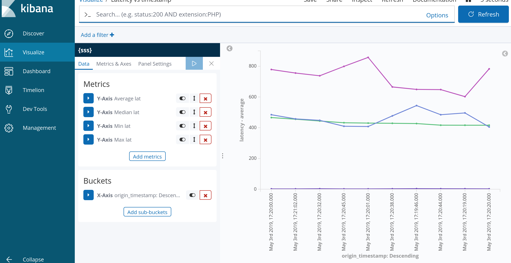

# elk_filter_parser_demo
This is a project aimed to teach everyone how to use elk stack and how to create new fields via GROK filters.

1. git clone https://github.com/ssriram1978/elk_filter_parser_demo.git
2. Install docker community edition.
2.a docker swarm init
3. Install docker-compose
4. cd elk_filter_parser_demo
5. sudo ./make_deploy.sh build_and_deploy all docker-stack-common.yml
6. docker ps
7. ifconfig | grep inet -- find out your natted ip
8. http://ip:5601  -- kibana
9. set the filter to the one it discovered
10. filebeat is the person who gets docker logs and feeds it to logstash.
11. filebeat.docker.yml - understand that
12. understand logstash.conf (this has the filter in it)
13. There is a plotter.py which will send the timestamp and latency in
milliseconds to the elk stack.
14. The task here is to extract the timestamp and latency into two
fields in elk stack. For this, I've used GROK filter (read about it)
to extract these 2 parms via logstash.conf.
15. In Kibana, when you open it, you should automatically see these 2
fields show up in every message.
16. Once you get to this point. the next step is to use visualizer to
plot these two values at run time. (X axis is the timestamp, Y axis is
the latency).
17. Scripted fields:
You can use scripted fields in visualizations and display them in your
documents.
In order to convert latency string to float, I used this script in Kibana:
latency --> painless  --> return Float.parseFloat(doc['latency.keyword'].value);

Ping me for any questions.

Good luck.
